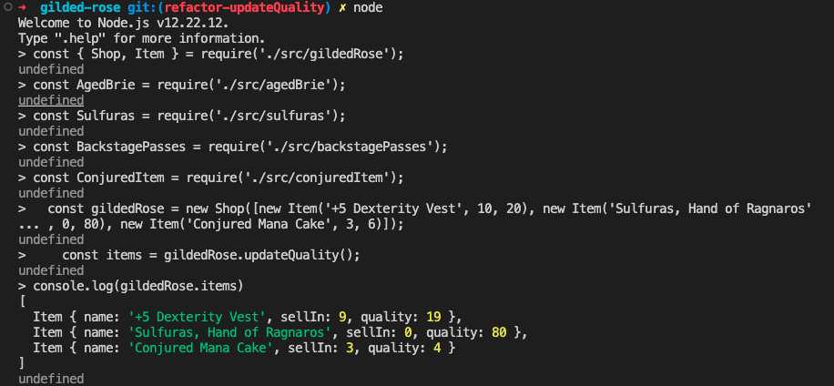

# Gilded Rose tech test

This is the Gilded Rose kata in JavaScript with Jest.

My personal approach to this problem was to start by creating tests that would cover all the expected requirements.

Once the tests were all created and passing, I implemented the new feature for "Conjured" items.

Following this, I refactor the code, which was initially a long function with nested if statements into different classes that would take care of the updates of each of the special items (Aged Brie, Sulfuras, Backstage passes and Conjured items).

This resulted in code that is much more readable and easy to change. If we wanted to implement a new special item, we would only need to create a new class that handled its particular updates and then add it to the main updateQuality function in the Shop class.

## Getting started

### Install dependencies

`npm install`

### Running tests

To run all tests

`npm test`

### To run all tests in watch mode

`npm run test:watch`

### To generate test coverage report

`npm run test:coverage`

### To use the application on your terminal:

`nvm use node`

### To run an example of usage on your terminal:

`node ./exampleOfUse.js`

Or open `node` and run the following code:

```bash
const { Shop, Item } = require('./src/gildedRose');
const AgedBrie = require('./src/agedBrie');
const Sulfuras = require('./src/sulfuras');
const BackstagePasses = require('./src/backstagePasses');
const ConjuredItem = require('./src/conjuredItem');


  const gildedRose = new Shop([new Item('+5 Dexterity Vest', 10, 20), new Item('Sulfuras, Hand of Ragnaros'
, 0, 80), new Item('Conjured Mana Cake', 3, 6)]);
    const items = gildedRose.updateQuality();
console.log(gildedRose.items)
# [
#   Item { name: '+5 Dexterity Vest', sellIn: 9, quality: 19 },
#   Item { name: 'Sulfuras, Hand of Ragnaros', sellIn: 0, quality: 80 },
#   Item { name: 'Conjured Mana Cake', sellIn: 3, quality: 4 }
# ]
```

Example of usage:


## Gilded rose

This is a well known kata developed by Terry Hughes. This is commonly used as a tech test to assess a candidate's ability to read, refactor and extend legacy code.

\*"Hi and welcome to team Gilded Rose. As you know, we are a small inn with a prime location in a prominent city run by a friendly innkeeper named Allison. We also buy and sell only the finest goods. Unfortunately, our goods are constantly degrading in quality as they approach their sell by date. We have a system in place that updates our inventory for us. It was developed by a no-nonsense type named Leeroy, who has moved on to new adventures. Your task is to add the new feature to our system so that we can begin selling a new category of items. First an introduction to our system:

All items have a SellIn value which denotes the number of days we have to sell the item. All items have a Quality value which denotes how valuable the item is. At the end of each day our system lowers both values for every item. Pretty simple, right? Well this is where it gets interesting:

Once the sell by date has passed, Quality degrades twice as fast
The Quality of an item is never negative
“Aged Brie” actually increases in Quality the older it gets
The Quality of an item is never more than 50
“Sulfuras”, being a legendary item, never has to be sold or decreases in Quality
“Backstage passes”, like aged brie, increases in Quality as it’s SellIn value approaches; Quality increases by 2 when there are 10 days or less and by 3 when there are 5 days or less but Quality drops to 0 after the concert
We have recently signed a supplier of conjured items. This requires an update to our system:

“Conjured” items degrade in Quality twice as fast as normal items
Feel free to make any changes to the UpdateQuality method and add any new code as long as everything still works correctly. However, do not alter the Item class or Items property as those belong to the goblin in the corner who will insta-rage and one-shot you as he doesn’t believe in shared code ownership (you can make the UpdateQuality method and Items property static if you like, we’ll cover for you)."\*
